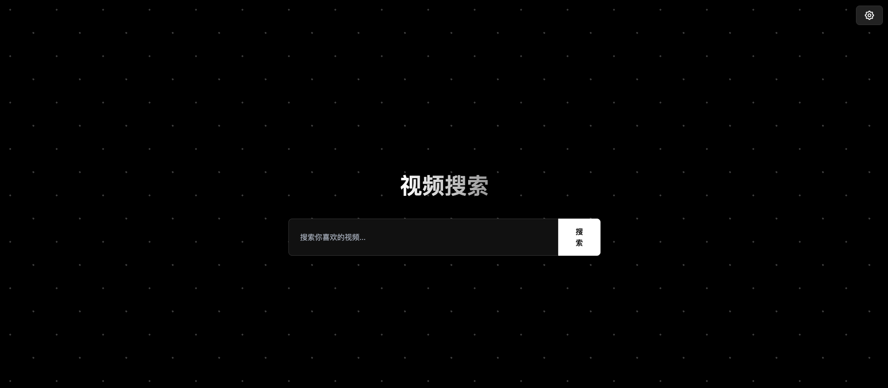

# 🚀 AI Pages

这里收集了我用 AI 开发或优化的小工具和小玩意儿，轻量、实用、打开即用。适合动手党、效率控、还有爱折腾的你

## 项目列表

| 项目名称           | 简要描述                           | 体验入口                      | 封面图                                   |
|--------------------|------------------------------------|-------------------------------|------------------------------------------|
| [舔狗语录生成器](./dog/README.md)      | 💘 一个有趣的舔狗语录生成网页应用，专为那些需要"舔狗文案"灵感的人设计。        | [👉 点击体验](https://quint11.github.io/ai-pages/dog/index.html)   |         |
| [Love 爱心动画](./love/README.md)      | 💗 这是一个浪漫的爱心动画网页, 可以用来表达浓浓的爱意。通过优雅的粒子动画和文字特效，营造出温馨浪漫的氛围。非常适合用作表白、纪念日等特殊场合。       | [👉](https://quint11.github.io/ai-pages/love/index.html)   |         |
| [天气卡片](./atmos/README.md)      | 🌈 Atmos是一个优雅的天气卡片应用，提供沉浸式的天气体验。通过精美的动画和交互效果，直观地展示不同天气状况。       | [👉](https://quint11.github.io/ai-pages/atmos/index.html)   |         |
| [工资计算器](./working-clock/README.md)      | 💰一个简洁的Web应用，帮助您实时追踪根据工时计算的预估收益。非常适合想知道“这个月/这周/今天已经赚了多少钱？”的朋友们！       | [👉](https://quint11.github.io/ai-pages/working-clock/index.html)   |         |
| [图片量尺器](./image-metering/README.md)      | ✨ 一款简单易用的在线图片量尺工具，帮助您在图片上快速测量和标注距离。非常适合设计师、装修人员或任何需要在图片上进行尺寸标注的场景。       | [👉](https://quint11.github.io/ai-pages/image-metering/index.html)   |         |
| [视频搜索工具](./video-search/README.md)      | 🔍一个帮你轻松找片、看片的视频搜索工具     | [👉](https://quint11.github.io/ai-pages/video-search/index.html)   |       
---

## ✨ 项目特点

| 特点 | 描述 |
|------|------|
| AI 驱动 | 使用AI技术开发或增强功能 |
| 响应式设计 | 适配各种屏幕尺寸 |
| 简洁高效 | 优化性能，快速加载 |

## 🛠️ 使用方法
1. 点击项目体验入口 [👉 点击体验](https://quint11.github.io/ai-pages)
2. 按照界面提示操作
3. 所有项目可直接在浏览器中运行

## 📜 许可证
本项目采用 [MIT 许可证](./LICENSE) 开源

## 🤝 贡献
欢迎贡献代码、文档或其他改进建议